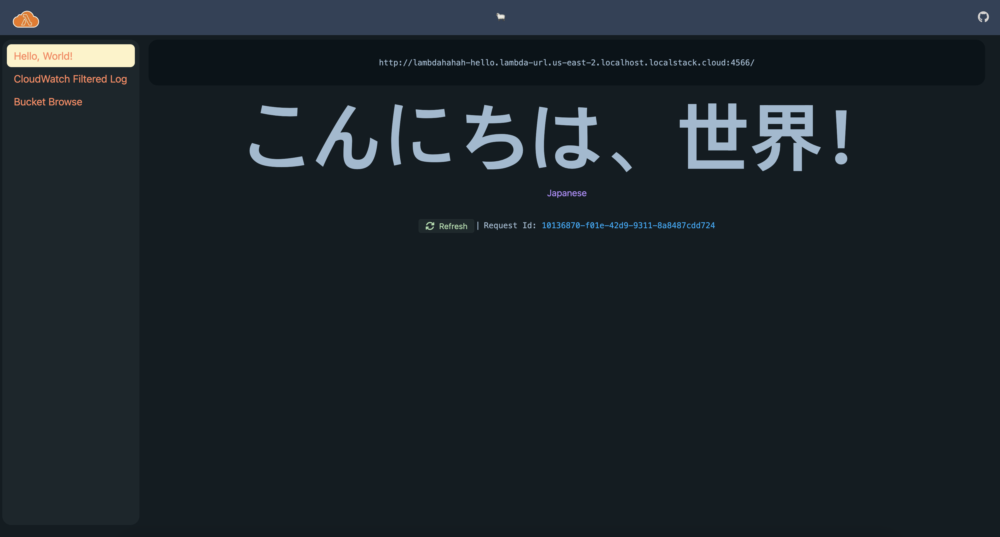
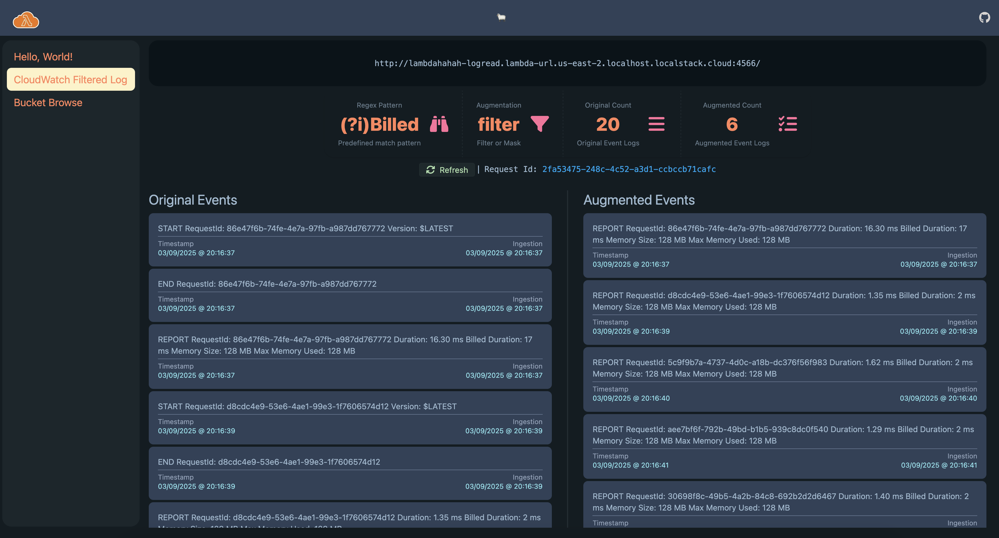
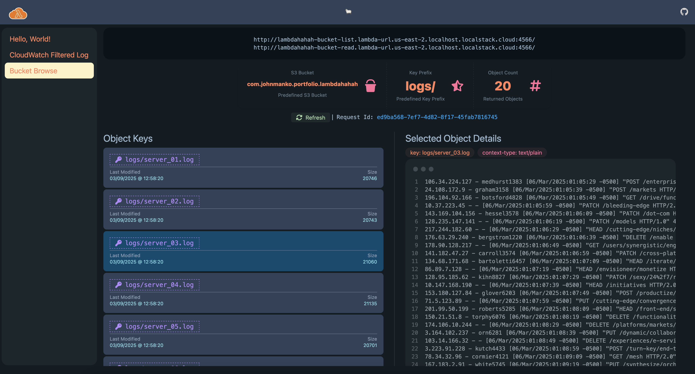

## Development server

To start a local development server, run:

```bash
npm install
ng serve
```

## Angular UI

There's an included Angular UI for playing with the deployed lambdas, but it's configured with LocalStack function urls.

### Screenshots

#### Hello


#### CloudWatch Events Logread


#### Bucket List and Object Read

